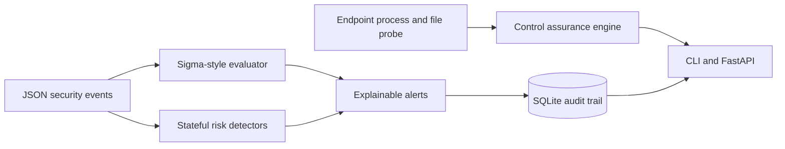

# ControlForge Security

[](https://github.com/Chanikya5793/controlforge-security/actions/workflows/ci.yml)
[](https://www.python.org/)
[](LICENSE)

ControlForge is a Python platform for continuously verifying endpoint security controls and converting raw security events into explainable detections. It combines read-only agent-health checks, a documented Sigma-style rule subset, stateful identity and insider-risk analytics, SQLite audit storage, a CLI, and a FastAPI service.

It is an engineering portfolio project built with public fixtures. Vendor configurations demonstrate extensible control checks; they do **not** imply access to vendor tenants or production customer data.

## Why this exists

Security teams need reliable answers to two operational questions:

1. Are required endpoint controls installed, running, and reporting?
2. Which events warrant investigation, and why did a rule match?

ControlForge makes both paths deterministic, testable, and API-accessible.



## Capabilities

- **Endpoint control assurance:** validates configured install evidence, process state, and optional heartbeat freshness. Example configurations cover CrowdStrike Falcon, Microsoft Defender for Endpoint, and SentinelOne.
- **Detection-as-code:** loads version-controlled YAML rules, validates their schema, and emits deterministic alert IDs and human-readable match reasons.
- **Supported Sigma-style operators:** equality/wildcards, `contains`, `startswith`, `endswith`, regular expressions, CIDR membership, `and`, `or`, `and not`, `1 of`, and `all of`.
- **Stateful analytics:** detects impossible-travel authentication and unusual sensitive-data access volume.
- **Investigation workflow:** persists normalized events and deduplicated alerts in SQLite, with bounded alert retrieval.
- **Operational interfaces:** command-line scanning plus a typed FastAPI service with OpenAPI documentation.
- **Safety controls:** read-only endpoint probes, no shell interpolation, bounded input batches, parameterized SQL, non-secret fixtures, static analysis, and dependency-light packaging.

## Quick start

```bash
python3 -m venv .venv
source .venv/bin/activate
python -m pip install -e '.[dev]'

# Evaluate the included event stream. Exit code 1 means alerts were produced.
controlforge scan --events examples/events.jsonl --rules rules --database /tmp/controlforge.db || true

# Check locally configured endpoint controls. Exit code 2 means a required control failed.
controlforge controls --config config/agents.yml || true

# Start the API and open http://127.0.0.1:8080/docs
controlforge serve --host 127.0.0.1 --port 8080
```

## API

| Method | Endpoint | Purpose |
|---|---|---|
| `GET` | `/health` | Service readiness and version |
| `GET` | `/v1/controls/check` | Run configured endpoint control checks |
| `POST` | `/v1/events/scan` | Normalize, evaluate, and persist an event batch |
| `GET` | `/v1/alerts?limit=100` | Retrieve recent deduplicated alerts |

Example:

```bash
curl -sS http://127.0.0.1:8080/v1/events/scan \
  -H 'Content-Type: application/json' \
  --data '{
    "events": [{
      "event_id": "demo-privilege-1",
      "event_type": "privileged_role_grant",
      "timestamp": "2026-08-11T14:00:00Z",
      "actor": "contractor@example.com",
      "target": "finance-db",
      "attributes": {"role": "database-owner", "change_ticket": "none"}
    }]
  }'
```

## Detection content

Included rules cover:

- encoded PowerShell execution;
- high-confidence phishing indicators;
- privileged role grants outside approved change workflow;
- impossible-travel authentication correlation;
- bulk sensitive-data access correlation.

Each alert includes a stable fingerprint, rule identifier, severity, actor, source event, matched evidence, and investigation tags.

## Quality gates

```bash
make verify
```

The verification target runs:

- Ruff lint and formatting checks;
- strict MyPy type checking;
- Pytest with an 85% coverage floor;
- Bandit security static analysis;
- wheel and source-distribution builds.

## Architecture and security decisions

- [Architecture](docs/architecture.md)
- [Threat model](docs/threat-model.md)
- [Security policy](SECURITY.md)

## Roadmap

- Authenticated vendor API adapters using least-privilege, read-only credentials
- Full pySigma backend interoperability and rule conversion
- Signed webhook ingestion and queue-backed processing
- OpenTelemetry metrics and rule-performance dashboards
- Analyst dispositions and false-positive feedback loops

## License

MIT. See [LICENSE](LICENSE).
